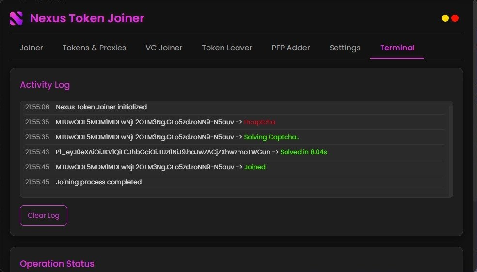

  

<h1 align="center">Nexus Token Joiner</h1>

  <strong>Production-ready synchronous request engine for automated token management.</strong>

  
  

  <a href="https://t.me/cfvatos">Telegram Update Channel</a> • <a href="https://t.me/cfdevelopment">Telegram Community Channel</a>

---

### System Interface

  

---

### Core Capabilities

* **Synchronous Request Pipeline** — Thread-stable execution tailored for strict rate-limit compliance and linear task tracking.
* **Identity Automation** — Native modules for bulk profile picture (PFP) deployment and server-specific nickname updates.
* **Gateway Clearance** — Direct network hooks designed to process and clear platform entry requirements seamlessly.

> [!NOTE]
> **Architecture Overview**
> Optimized entirely for lightweight HTTP requests. Eliminates the heavy footprint and overhead of browser-based automated frameworks.

---

### AnySolver Integration

Nexus interfaces natively with AnySolver to route and resolve entry verifications through a single gateway.

  

* **Unified API** — Consolidates separate configurations for CapSolver, TwoCaptcha, AntiCaptcha, and CapMonster into one endpoint.
* **Smart Routing** — Dynamically offloads challenges to the most cost-effective and low-latency node in real time.
* **Zero Vendor Lock-In** — A completely centralized abstraction layer for seamless third-party provider transitions.

> [!IMPORTANT]
> **Authentication Required**
> Automated captcha clearing requires an active account and valid API key from [AnySolver.com](https://anysolver.com).

---

### Official Partnership

  

> 🎁 **Exclusive Deal:** Get **10% OFF** your first 10GB with NodeProxies using coupon code:  
> **`VATOSMOGS`** — [Claim your discount here](https://nodeproxies.xyz/register?ref=4259899A).

---

### Custom Development

Bespoke solutions, private infrastructure, and tailored automation engines are available via corporate contract.

  <a href="https://t.me/VatosV2"><strong>Contact Lead Developer via Telegram</strong></a>

---

> [!WARNING]
> **Operational Disclaimer**
> This utility is designed strictly for educational, research, and authorized access-optimization testing. The development team accepts no liability for account mitigation, policy infractions, or operational misuse.
